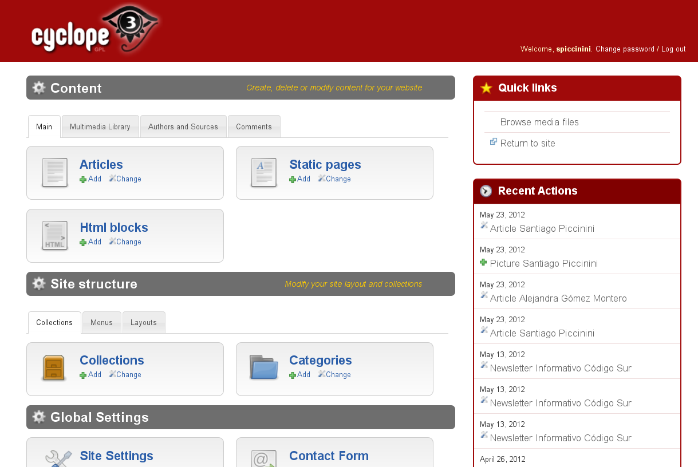

=============
Taller Django
=============

* Santiago Piccinini (SAn)
    * spiccinini@codigosur.org

* Código Sur
    * www.codigosur.org

* Universidad Estatal de Bolívar, Ecuador 
    * Agosto 2012

* `Creative Commons Atribución-CompartirIgual <http://creativecommons.org/licenses/by-sa/3.0/deed.es_AR>`_

.. image:: static/img/cc_by_sa-3.png

----

Introducción
============

* Framework
* DRY
* MVC
* Licencia BSD

Algunas características sobresalientes

* Documentación
* Interfaz CRUD automática
* Internacionalizacion

----

Historia
========

* Diario Lawrence Journal-World en 2003-2004.
* Liberado como Software Libre en 2005
* Django 1.0 en 2008
* Django 1.4 en 2012

Comunidad
---------

* Core commmiters, proceso abierto
* Lista de mails ``python-developers``
* DjangoCon

----

MVT (MCV)
=========

Modelos
-------

Definición y manejo de los datos.

Crear, Modificar, Guardar, etc

Vistas
------

Lógica de la aplicación.

Reacciona con HTTP (GET, PUT, POST, etc)

Templates
---------

Visualización de la información

----

ORM
===

.. sourcecode:: python

    # models.py
    from django.db.models import Model, ...

    ESTADOS = (('AB', 'Abierto'), ('CE', 'Cerrado'),
               ('CU', 'En curso'))

    class Ticket(Model):
      titulo = CharField(max_length=150)
      descripcion = TextField()
      autor = ForeignKey('User')
      fecha_creacion = DateTime(auto_now_add=True)
      asignado_a = ForeignKey('User', null=True, 
                              blank=True)
      estado = CharField(max_length=2, choices=ESTADOS)

----

sqlall
------

.. sourcecode:: sql

    $ python manage.py sqlall tickets
    BEGIN;
    CREATE TABLE "tickets_ticket" (
     "id" integer NOT NULL PRIMARY KEY,
     "titulo" varchar(150) NOT NULL,
     "descripcion" text NOT NULL,
     "autor_id" integer NOT NULL REFERENCES "auth_user" ("id"),
     "fecha_creacion" datetime NOT NULL,
     "asignado_a_id" integer REFERENCES "auth_user" ("id"),
     "estado" varchar(2) NOT NULL
    )
    ;
    CREATE INDEX "tickets_ticket_32ec34e8" ON "tickets_ticket" ("autor_id");
    CREATE INDEX "tickets_ticket_4a1d037a" ON "tickets_ticket" ("asignado_a_id");
    COMMIT;

----

consultas
---------

.. sourcecode:: python

    >>> Ticket.objects.all()
    []
    >>> Ticket.objects.create(
            titulo='Un bug',
            descripcion='Bug de prueba',
            autor=usuario, estado='AB')

    >>> Ticket.objects.filter(autor=usuario)
    [ticket]

----

Templates
=========

* Blanace entre poder y simplicidad
* Pensado para diseñadores
* Similar a otros sistemas como Smarty

Herramientas
------------

Variables (viene de una vista)

* Tags: logica
* Filtros: alteraciones

----

.. sourcecode:: django

    <h1>Listado de Tickets</h1>

    <ul>
    
    <li>
      <a href="{{ ticket.get_absolute_url }}">
        {{ ticket.title|upper }}
      </a>
    </li>
    
{{ ticket.descripcion|truncatewords:"15" }}

    
    </ul>

----

Vistas
======

* Lógica de la aplicación
* Función normal
* Argumento: Request
* Valor de retorno: Response

----

.. sourcecode:: python

    from django.http import HttpResponse
    import datetime

    def mostrar_fecha(request):
      fecha = datetime.date.today()
      html = "<html><body>La fecha es %s.</body></html>" % fecha
      return HttpResponse(html)

----

.. sourcecode:: python

    from django.http import HttpResponse
    from django.shortcuts import
    from models import Ticket

    def listar_tickets_abiertos(request):
      tickets = Ticket.objects.filter(estado="AB")
      return render(request, "tickets/lista.html", {
          "lista_tickets": tickets
          })

----

urls
====

* Urls limpias
* Cualquiér tipo de diseño
* URLConf: relaciona regex con views

.. sourcecode:: python

    urlpatterns = patterns('',
        url(r'^$',
            'tiquetera.tickets.views.listar_tickets',
            name='ticket-listado'),
        url(r'^ticket/(?P<id>\d+)/$',
            'tiquetera.tickets.views.detalle_ticket',
            name='ticket-detalle'),
        url(r'^admin/', include(admin.site.urls)),
    )

----

Forms
=====

.. sourcecode:: python

    class ContactForm(forms.Form):
        asunto = forms.CharField(max_length=100)
        mensaje = forms.CharField()
        remitente = forms.EmailField()
        cc_a_mi = forms.BooleanField(required=False)

    def contact(request):
        if request.method == 'POST':
            form = ContactForm(request.POST)
            if form.is_valid():
                asunto = form.cleaned_data['asunto']
                # ...
                return HttpResponseRedirect('/gracias/')
        else:
            form = ContactForm()
        return render(request, 'contact.html', {
            'form': form,
        })

----

Model Forms
===========

.. sourcecode:: python

    class TicketForm(forms.ModelForm):
      class Meta:
        model = Ticket

    def editar_ticket(request, id):
      ticket = Ticket.objects.get(id=id)
      if request.method == "POST":
        form = TicketForm(request.POST, instance=ticket)
        if form.is_valid():
          form.save()
          return redirect("ticket-detalle", id=id)
      else:
          form = TicketForm(instance=ticket)
      return render(request, "ticket_editar.html", {
                    "ticket": ticket,
                    "form": form,
                })

----

Comandos
========

``django-admin.py`` y ``manage.py``, algunos comandos:

* ``startproject``
* ``startapp``
* ``runserver``: servidor de desarrollo
* ``shell``
* ``test``
* ``syncdb``: crea tablas según modelos
* ``dumpdata`` y ``loaddata``
* ``inspectdb`` para bases de datos existentes

``./manage.py comando [--opciones]``

----

Settings
========

El archivo ``settings.py``:

* Contiene la configuración del proyecto
    * conf de base de datos
    * Idioma
    * ``STATIC_URL`` y ``STATIC_ROOT``
    * configuración de logging
    * aplicaciones instaladas

----

Otros
=====

* signals
* i18n
* testing
* sessions
* caching
* logging
* syndication (rss, atom)
* transactions
* seguridad (CSRF, XSS, etc)

----

Aplicaciones
============

* Encapsulación
* Distribución
* ./manage.py startapp mi_app

::

    mi_app
    mi_app/models.py
    mi_app/views.py
    mi_app/tests.py
    my_app/templates/
    ...

----

Admin
=====

Interfaz ABM (CRUD)

* Muy configurable
* Fácil de extender
* No es bala de plata!

----

Admin (cont)
============

.. sourcecode:: python

    import models
    from django.contrib import admin

    class TicketAdmin(admin.ModelAdmin):
        date_hierarchy = 'fecha_creacion'
        list_display = ('__unicode__', 'autor',
                        'asignado_a', 'fecha_creacion',
                        'proyecto', 'estado' )
        list_display_links = ('proyecto', )
        list_editable = ('asignado_a', 'estado')
        list_filter = ('proyecto__nombre', 'estado')
        search_fields = ['id', 'titulo', 'descripcion']

    admin.site.register(Ticket, TicketAdmin)

----

Cyclope 3
=========

----

Auth
====

* Autenticación
* Autorización (permisos)
* Usuarios
* Grupos
* Login
* Passwords (encriptados)
* Profiles

----

Aplicaciones comunidad
======================

* ``south``: migraciones
* ``django-registration``
* ``django-haystack``: búsquedas
* ...

----

Deployment
==========

* Servidor de desarrollo: ``./manage.py runserver``
* Apache: mod_wsgi
* Otros: fcgi

----

Testing
=======

.. sourcecode:: python

    class TicketTest(TestCase):
        def setUp(self):
            self.user = User.objects.create_user('juan', 'juan@midom.org',
                                                 'passwd')
            self.simple_ticket_conf = {
                "titulo": "Bug de prueba",
                "descripcion": "Descripcion de un bug de prueba",
                "autor": self.user,
            }

        def test_basic_creation(self):
            ticket = Ticket.objects.create(**self.simple_ticket_conf)
            self.assertEqual(ticket.id, 1)
            self.assertEqual(ticket.estado, "AB")

        def test_listar_tickets(self):
            response = self.client.get(reverse("ticket-listado"))
            self.assertEqual(response.status_code, 200)

----

Aplicación
==========

...
