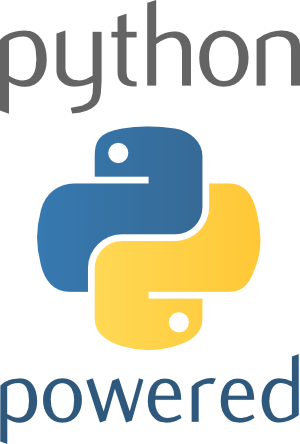
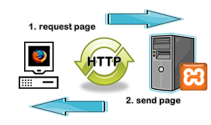
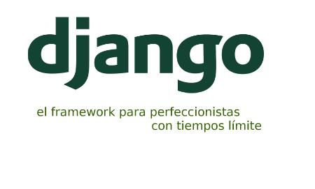
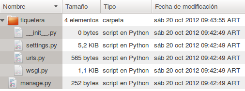
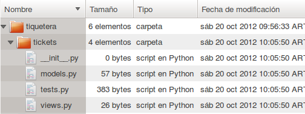

==========================================
Django, el framework para perfeccionistas
==========================================

**Taller Introductorio**

:autor: Martín Gaitán
:conferencia: Atica iSummit 2012
:lugar: Loja, Ecuador
:fecha: Lunes 22 de octubre, 2012

|
|

.. image:: static/img/cc_by_sa-3.png

----

Quién
======

- Martín Gaitán
- Ingeniero en Computación - Universidad Nacional de Córdoba, Argentina
- Hincha de Boca Jr.
- Python desde 2007, Django desde 2010
- Miembro de Python Argentina (python.org.ar)
- Creando Phasety (phasety.com) y trabajando en Machinalis (machinalis.com)

    @tin_nqn_   gaitan@gmail.com  http://mgaitan.github.com

----

Qué
======

- Micro introduccion a Python
- Micro introducción a "la web"
- Introducción a Django

    - Ideas generales
    - Modelos
    - Vistas
    - Templates
    - URL
    - Tests

----

Cómo
======

- Es un minicurso-taller
- En los talleres nos engrasamos las manos **¡Eso es muy bueno!**

    - Haremos un pequeño proyecto

- ¿Trabajamos en equipos ?
- Más explicaciones que diapositivas
- Pueden preguntarme en cualquier momento / Puedo no saber responder de inmediato.

----

Warning
===========

    A veces hablo mucho. :-/

----

Créditos
=========

Este material está basado en trabajos de

- Santiago Piccinini
- Alejandro Peralta
- Daniel Moisset
- Ramiro Morales

Bajo licencias Creative Commons by-sa

**¡Gracias!**

----

Empezamos ?
============

.. epigraph::

    El canónico *"Python es un gran primer lenguaje"* suscitó
    *"¡Python es un gran último lenguaje!"*

    -- Noah Spurrier

----

En serio, qué es Python ?
===========================

* Un lenguaje de muy alto nivel
* (muy) Fácil de aprender, con sintáxis legible y expresiva
* Multiplataforma Multiparadigma
* Interactivo, Interpretado y Dinámico (pero fuertemente tipado)
* Extensible
* Libre, Gratis y amigable comercialmente
* Con las baterías incluídas (y grandes aplicaciones)
* Con gran documentación
* y una maravillosa comunidad de usuarios

----

Quién lo usa
=============

.. epigraph::

    Si no me dedicara al fútbol programaría Python

    -- Lionel Messi

----

En serio
++++++++

- Google
- NASA
- Mozilla
- Las empresas donde trabajo
- Ustedes!

----

Para qué sirve Python
=======================

- Scripting general rápido
- Ingeniería
- Web
- Juegos
- Procesamiento de texto y lenguaje
- Interfaz entre distintos lenguajes
- Mucho, mucho más...
- Y la combinación de todas ellas

----

Tan fácil de aprender?
========================

- Podemos explorar la respuesta.
- Ejecutar la consola interactiva

.. sourcecode:: python

    $ python
    Python 2.7.3 (default, Aug  1 2012, 05:14:39)
    [GCC 4.6.3] on linux2
    Type "help", "copyright", "credits" or "license" for more information.
    >>>

----

Pero mejor ``ipython``
======================

.. sourcecode:: bash

    $ ipython
    Python 2.7.3 (default, Aug  1 2012, 05:14:39)
    Type "copyright", "credits" or "license" for more information.

    IPython 0.13 -- An enhanced Interactive Python.
    ?         -> Introduction and overview of IPython's features.
    %quickref -> Quick reference.
    help      -> Python's own help system.
    object?   -> Details about 'object', use 'object??' for extra details.

    In [1]:

- Nuestros aliados: ``<tab>`` y ``?``

----

¡A practicar!
=============

.. sourcecode:: python

    In [1]: 10 + 4
    Out[1]: 14

    In [2]: saludo = 'Ubyn Ybwn!'

    In [3]: print saludo.decode('rot13') # que sucede?

    In [4]: import this   # y esto?

----

Dijimos **muy** alto nivel
===========================

Python trae potentes estructuras de datos *built-in*

    * Listas: contenedor ordenado de objectos
    * Tuplas: simil a listas pero *inmutables*
    * Diccionarios: mapas clave-valor
    * Conjuntos: objetos unicos, no ordenado
    * y más!

-----

Listas
=======

.. sourcecode:: python

    >>> a = [100, 'huevos', 'sal']
    >>> a
    [100, 'huevos', 'sal']
    >>> a[0]
    100
    >>> a[-2:]
    ['huevos', 'sal']
    >>> a + ['oro', 9]
    [100, 'huevos', 'sal', 'oro', 9]
    >>> a[0] = "manteca"
    >>> a
    ['manteca', 'huevos', 'sal']

----

Diccionarios
============

.. sourcecode:: python

    >>> dias = {"Ene": 31, "Jul": 30}
    >>> dias
    {'Ene': 31, 'Jul': 30}
    >>> dias["Ene"]
    31
    >>> dias["Ago"] = 31
    >>> dias["Jul"] = 31
    >>> dias
    {'Ago': 31, 'Ene': 31, 'Jul': 31}
    >>> "Mar" in dias
    False
    >>> dias.keys()
    (['Ago', 'Ene', 'Jul']
    >>> dias.values()
    [31, 31, 31])

----

Bucles
=======

- No hacen falta índices

.. sourcecode:: python

    >>> bichos = ["pulgas", "piojos"]
    >>> for bich in bichos:
    ...     print "Mata-" + bich
    ...
    Mata-pulgas
    Mata-piojos

----

If
===

.. sourcecode:: python

    if <expresion>:
        <suite>
    elif <expresion>:
        <suite>
    else:
        <suite>

- ``<expresion>`` evalúa a verdadero o falso
- ``<suite>`` un bloque de código (con la misma sangría)
- operadores: ``or``, ``and``, ``not``
- comparadores: ``< > == != in is``

----

Y ahora, un programa
=====================

Abrir un editor (``gedit``, por ejemplo) y escribir una **función**

.. sourcecode:: python

    def alcuadrado(n):
        res = n ** 2
        return res

    print alcuadrado(3)

Guardarlo como ``cuadrado.py`` y ejecutarlo::

    $ python cuadrado.py

----

Puede haber valores por *default*
=================================

.. sourcecode:: python

    def potenciar(n, exp=2):
        res = n ** exp
        return res

    >>> potenciar(2, 3)
    8

    def oracion(sujeto, verbo="corre", modificador="lento"):
        return "%s %s %s" % (sujeto, verbo, modificador)

    >>> oracion("El conejo", modificador="veloz")
    'El conejo corre veloz'

----

Espacios de nombre
===================

Python es modular y tiene *espacios de nombre*

    * Un ``.py`` es un módulo.
    * Un directorio con ``__init__.py`` es un paquete

.. sourcecode:: python

    >>> from cuadrado import alcuadrado
    >>> alcuadrado(1j)
    (-1+0j)

-----

Clases
=======

.. sourcecode:: python

    # posicion.py

    import math     # baterias incluídas!

    class Posicion(object):

        def __init__(self, x, y):
            self.x = x
            self.y = y

        def distancia(self):
            """La hipotenusa. Pitágoras programaba Python"""
            x = self.x**2 + self.y**2
            return math.sqrt(x)

-----

Y usamos
=========

.. sourcecode:: python

    >>> import posicion    # importa todo el módulo
    >>> p1 = posicion.Posicion(3, 4)
    >>> p1.x
    3
    >>> p1.dist()
    5.0
    >>> p2 = posicion.Posicion(7, 9)
    >>> p2.y
    9
    >>> p1.y
    4

----

Herencia
=========

.. sourcecode:: python

    class PosicionRect(Posicion):
        """ Sistema sin diagonales """

        def distancia(self):
            return float(self.x + self.y)

    >>> p1 = PosicionRect(3, 4)
    >>> p1.dist()
    7.0

----

Métodos especiales
===================

.. sourcecode:: python

    class Posicion(object):
        ...

        def __unicode__(self):
            return u'(%.2f, %.2f)" % (self.x, self.y)

    >>> print p1
    u'(3.00, 4.00)'

----

Ya sabemos suficiente!
======================

Vayamos a la web!

----

A dónde?
=========

- La web usa el protocolo ``HTTP``
- Peticiones y respuestas...
- Entre un cliente y un servidor

----

Peticiones (*requests*)
========================

Mediante métodos, cabecera y parámetros (datos). Importantes:

- ``GET`` (pedir)
- ``POST`` (modificar)

- En general cuando uno *entra* a una página hace ``GET`` y cuando
  envia un formulario hace ``POST``.

----

Respuestas (*responses*)
===========================

- Código, Cabecera y Datos

    ``200 OK``, ``404 Not Found``

- Hypertext Transfer? Ahora es cualquier cosa!

  * html, json, fotos, videos de goles de Messi, etc.

----

Entonces: Django!
=================

|
|
|

-----

Claves
=======

* Framework: caja de legos!
* DRY
* MVC
* Licencia BSD
* Excelente documentación
* Baterías incluídas !

----

MVT (MCV)
=========

**Modelos**

    Definición y manejo de los datos. (Crear, Modificar, Guardar, etc)

**Vistas**

    Lógica de la aplicación. Reacciona con HTTP

**Templates**

    Visualización de la información

----

¿Qué hay en las baterías?
=========================

- Interacción con base de datos relacionales
- Abstracción ORM
- Interfaz CRUD automática
- Testing
- Usuarios y autenticación
- Manejo de formularios
- Paginación
- Seguridad (CSRF, XSS, etc)
- Muchas otras cosas resueltas!

----

¡Engrasemosnos las manos!
=========================

- Objetivo: un sitio para manejar tickets (*bugs*, por ejemplo)
- Lo llamaremos

    **"La Tiquetera"**

----

Comenzar un proyecto
====================

Qué llama Django un Proyecto?

    Conjunto de aplicaciones y configuraciones para un sitio en particular

.. sourcecode:: bash

    $ django-admin.py startproject tiquetera

-----

Con una aplicación
==================

Y qué es una Aplicación ?

    - Una aplicación web que hace una tarea en particular (*weblog*, *encuesta*, etc)
    - Un proyecto puede tener muchas *apps*.
    - Una aplicación puede ser parte de distintos proyectos (son *pluggables*)

-----

.. sourcecode:: bash

    $ cd tiquetera
    $ django-admin.py startproject tiquetera

----

Algunos comandos
================

``django-admin.py`` y ``manage.py``:

* ``startproject``
* ``startapp``
* ``runserver``: servidor de desarrollo
* ``shell``
* ``test``
* ``syncdb``: crea tablas según modelos
* ``dumpdata`` y ``loaddata``
* ``inspectdb`` para bases de datos existentes

``./manage.py help [comando]``

----

Settings
========

El archivo ``settings.py``:

* Contiene la configuración del proyecto
    * conf de base de datos
    * Idioma
    * ``STATIC_URL`` y ``STATIC_ROOT``
    * aplicaciones instaladas
    * etc.

----

El nuestro
==========

.. sourcecode:: python

    DATABASES = {
    'default': {
        'ENGINE': 'django.db.backends.sqlite3',
        'NAME': 'db.sqlite',
        ...

    INSTALLED_APPS = (
        ...
        'django.contrib.admin',
        'tiquetera.tickets',)

----

Volvamos a la tiquetera
========================

**Requerimientos**

- Un ticket tiene un **id**, un **estado**, una **fecha**, un
  **título** y **descripción** y posiblemente un **responsable**
- Queremos ver listados de tickets, su detalle, cargar nuevos,
  cambiarles el estado, asignarles responsable, etc.

----

Modelando
==========

.. sourcecode:: python

    # models.py
    from django.db import models
    from django.contrib.auth.models import User

    ESTADOS = (('AB', 'Abierto'), ('CE', 'Cerrado'),
               ('CU', 'En curso'))

    class Ticket(models.Model):
        titulo = models.CharField(max_length=150)
        descripcion = models.TextField()
        autor = models.ForeignKey(User)
        fecha_creacion = models.DateTime(auto_now_add=True)
        asignado_a = models.ForeignKey(User, null=True,
                              blank=True)
        estado = models.CharField(max_length=2, choices=ESTADOS)

----

Construyamos la base
=====================

    $ python manage.py syncdb

----

¡Magia ORM!
===========

.. sourcecode:: sql

    $ python manage.py sqlall tickets
    BEGIN;
    CREATE TABLE "tickets_ticket" (
     "id" integer NOT NULL PRIMARY KEY,
     "titulo" varchar(150) NOT NULL,
     "descripcion" text NOT NULL,
     "autor_id" integer NOT NULL REFERENCES "auth_user" ("id"),
     "fecha_creacion" datetime NOT NULL,
     "asignado_a_id" integer REFERENCES "auth_user" ("id"),
     "estado" varchar(2) NOT NULL
    )
    ;
    CREATE INDEX "tickets_ticket_32ec34e8" ON "tickets_ticket" ("autor_id");
    CREATE INDEX "tickets_ticket_4a1d037a" ON "tickets_ticket" ("asignado_a_id");
    COMMIT;

----

Usando nuestros modelos interactivamente
=========================================

.. sourcecode:: bash

    $ python manage.py shell

.. sourcecode:: python

    >>> from tiquetera.tickets.models import Ticket
    >>> from django.contrib.auth.models import User
    >>> usuario = User.objects.all()[0]
    >>> Ticket.objects.all()
    []

----

    >>> Ticket.objects.create(
            titulo='Un bug',
            descripcion='Bug de prueba',
            autor=usuario, estado='AB')

    >>> Ticket.objects.filter(autor=usuario)
    [ticket]
    >>> t = Ticket.objects.filter(autor=usuario)[0]
    >>> t.titulo
    'Un bug'

----

Usemos  Admin
===============

Interfaz ABM (CRUD)

* Muy configurable
* Fácil de extender
* ¡Pero no es la bala de plata!

----

Admin (cont)
============

.. sourcecode:: python

    # admin.py
    import models
    from django.contrib import admin

    class TicketAdmin(admin.ModelAdmin):
        date_hierarchy = 'fecha_creacion'
        list_display = ('__unicode__', 'autor',
                        'asignado_a', 'fecha_creacion',
                        'proyecto', 'estado' )
        list_display_links = ('proyecto', )
        list_editable = ('asignado_a', 'estado')
        list_filter = ('proyecto__nombre', 'estado')
        search_fields = ['id', 'titulo', 'descripcion']

    admin.site.register(Ticket, TicketAdmin)

----

Arrancamos el servidor de pruebas
=================================

.. sourcecode:: bash

    $ python manage runserver

- Y vamos en el navegador a

  http://localhost:8000/admin

----

Hagamos *nuestras* paginas
==========================

**Vistas**

* Lógica de la aplicación
* Función normal
* Argumento: Request
* Valor de retorno: Response

